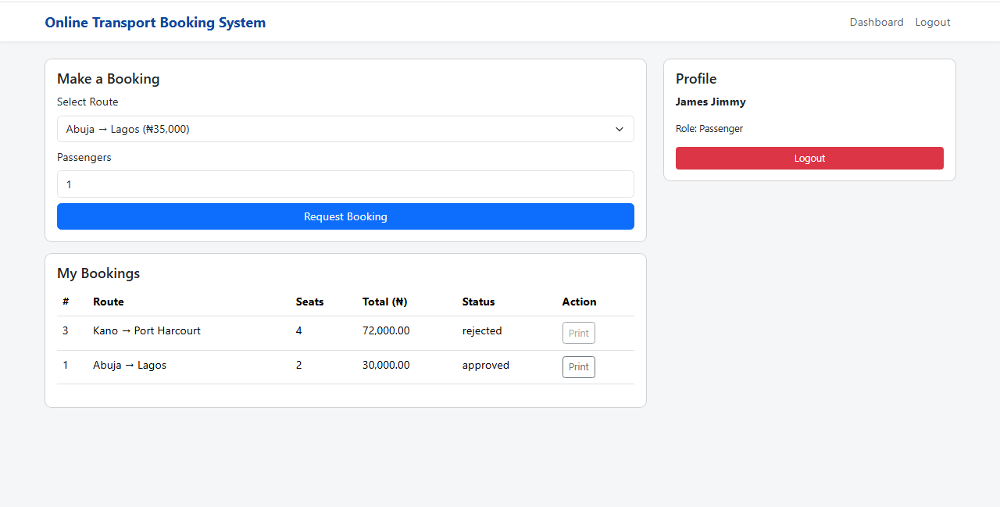

# 🚌 Transport Booking System

A simple frontend for booking passenger trips, scheduling, and managing reservations.

---

## 🧠 Tech Stack
HTML | CSS | JavaScript | Bootstrap | PHP (basic for backend)

---

## ✨ Features
- Search available routes and times
- Book seats and view booking list
- Responsive booking form and admin view
- Input validation and simple confirmation flow

---

## ⚙️ How to Run
1. Clone this repo.
2. Open `index.html` on a static server or in a browser.
3. For PHP backend features, host on XAMPP/WAMP and configure database.

---

## 📸 Screenshots

---

## 📄 License
Portfolio project.
